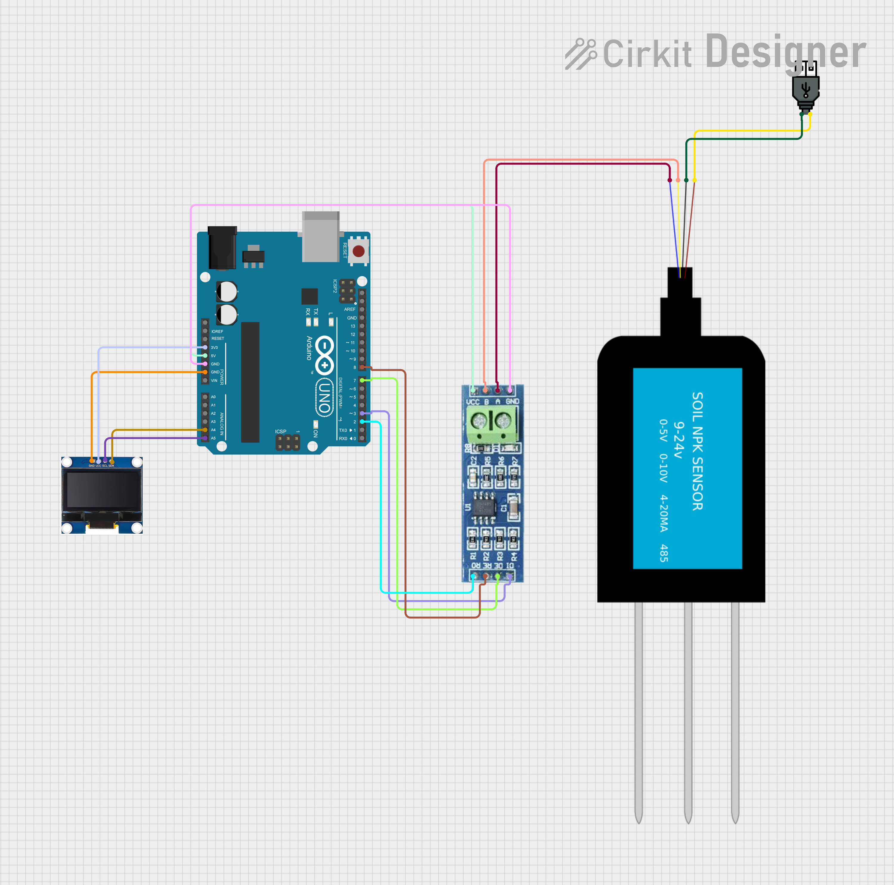

# 🌾 Smart Crop Recommendation System using Machine Learning

An IoT-based Smart Crop Recommendation System that predicts the most suitable crop based on soil nutrient values. The project combines hardware interfacing, machine learning, and data visualization to assist in agricultural decision-making.

---

# 📌 Project Overview

Selecting the appropriate crop based on soil conditions is an important factor in improving agricultural productivity. This project reads Nitrogen (N), Phosphorus (P), and Potassium (K) values from a soil NPK sensor using an Arduino Uno. These values are used to train a Machine Learning model capable of recommending the most suitable crop.

A Power BI dashboard is also developed to visualize crop recommendations and dataset insights.

---

# 🎯 Objectives

- Read real-time soil NPK values using an Arduino Uno.
- Display sensor readings on an OLED display.
- Train a Machine Learning model using soil and environmental parameters.
- Predict the most suitable crop based on the input data.
- Visualize agricultural insights using Power BI.

---

# ⚙ Hardware Components

- Arduino Uno
- Soil NPK Sensor (RS485 Modbus)
- MAX485 TTL to RS485 Module
- OLED Display (SSD1306)
- Jumper Wires
- USB Cable

---

# 🖥 Software & Tools

- Arduino IDE
- Python
- Jupyter Notebook
- Power BI
- Google Colab

---

# 🤖 Machine Learning

The machine learning model is trained using the Crop Recommendation dataset containing the following features:

- Nitrogen
- Phosphorus
- Potassium
- Temperature
- Humidity
- pH
- Rainfall

The trained model predicts the most suitable crop based on these agricultural parameters.

---

# 📊 Power BI Dashboard

The Power BI dashboard provides visual insights from the crop recommendation dataset, helping users better understand soil conditions, crop distribution, and feature relationships.

---

# 🔌 Hardware Circuit

---

# 📂 Project Files

- `Crop_Recommendation.ino` – Arduino program for reading NPK sensor values and displaying them on the OLED display.
- `Model_Training.ipynb` – Machine Learning model training notebook.
- `Crop Recommendation Dashboard.pbix` – Interactive Power BI dashboard.
- `Crop_recommendation.csv` – Dataset used for training the ML model.
- `Circuit_Diagram.png` – Hardware connection diagram.

---

# 🛠 Technologies Used

- Arduino
- Embedded C++
- Python
- Machine Learning
- Power BI
- RS485 Modbus Communication

---

# 📚 Key Learnings

Through this project, I gained practical experience in:

- Interfacing hardware sensors with Arduino.
- Reading soil nutrient values using RS485 Modbus communication.
- Training and evaluating Machine Learning models.
- Applying data visualization using Power BI.
- Integrating embedded systems with data analytics.

---

# 👩‍💻 Author

**Ankita A**

Electronics and Communication Engineering Student

Aspiring Data Analyst | Machine Learning Enthusiast
